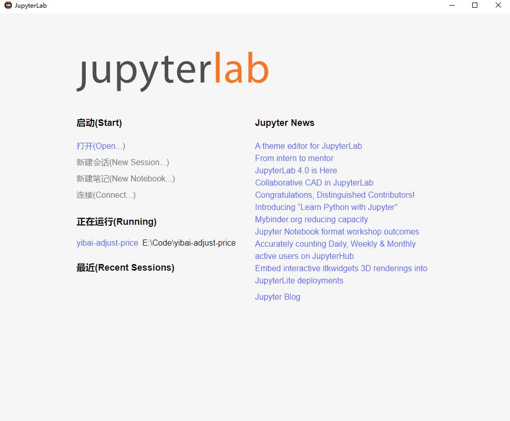

# JupyterLab Desktop


JupyterLab Desktop 是基于 [Tauri](https://github.com/tauri-apps/tauri) 开发的 JupyterLab 桌面客户端。相比官方客户端，它非常轻量，仅有不到 5M 大小。


## 使用

1. 安装 Python
2. 安装 jupyterlab 依赖包，具体参考 [Jupyterlab Installation](https://jupyterlab.readthedocs.io/en/latest/getting_started/installation.html)
3. 在 [Release](https://github.com/l1xnan/jupyterlab-desktop/releases/latest) 页面，下载最新的安装包，安装即可使用。


注意：当前版本仅支持系统级别的`jupyter`安装，不支持识别虚拟环境中的`jupyter`安装。可以将虚拟环境添加到 Jupyter Kernel 管理：
```bash
$ .\.venv\Scripts\activate
$ pip install --user ipykernel
$ python -m ipykernel install --user --name=myenv
```


